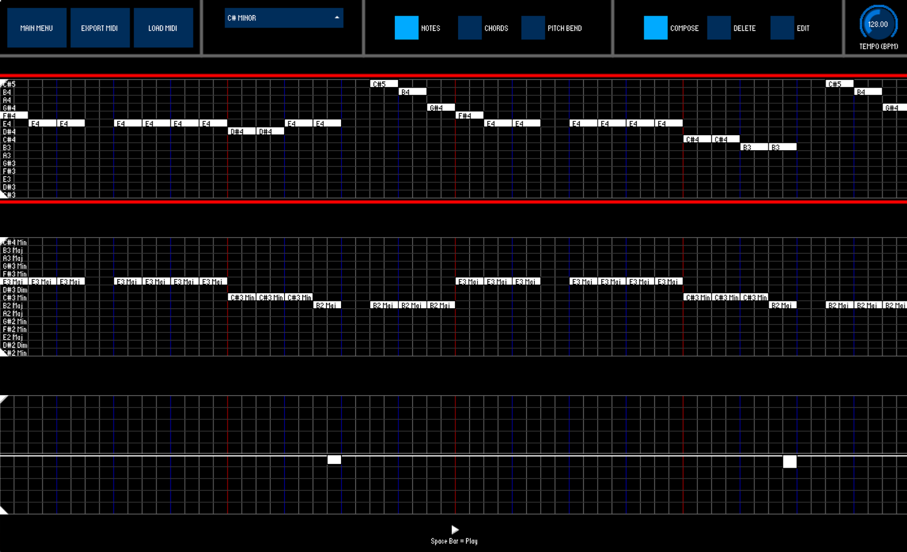

# MScDissertationProject - Joseph M. Cameron
## The Novel MIDI Controller: Designing & Implementing a User-Centred MIDI Controller
This repository contains the code, meeting minutes, status reports, and final dissertation report for my MSc Dissertation Project which was undertaken at the University of St Andrews for an MSc in Human-Computer Interaction.
This project was supervised by Professor Ian Miguel ([Professor Ian Miguel's St Andrews Profile](https://www.st-andrews.ac.uk/computer-science/people/ijm)) and Kenneth Boyd  (https://www.kennethboyd.com).

-----------------------------------

This dissertation received a distinction grade of **19** on the [University of St Andrews 20 Point Grading Scale](https://www.st-andrews.ac.uk/policy/academic-policies-assessment-examination-and-award-common-reporting-scale/common-reporting-scale.pdf).
The final dissertation PDF can be viewed and downloaded here: [MSc Dissertation PDF](Dissertation/The_Novel_MIDI_Controller_MSc_Dissertation_by_Joseph_Cameron.pdf).

-----------------------------------

### Abstract
Traditionally, MIDI controllers have been designed to cater towards musicians with extensive experience in music theory and ample experience playing musical instruments.
However, many people with musical interests can feel intimidated or discouraged to get musically creative with these practices.
The non-musicians with a creative urge is a largely overlooked audience in the domain of music composition and music production.
In this project, the user-centred design method was employed to design a new touch-free MIDI controller in Processing and Java with the Leap Motion controller sensing user interactions.  
  

<b>The Steps of the User-Centred Design Method.</b>

  
First, a literature review was performed to prepare enough background knowledge to tackle the project’s aims.

Then, an initial user research study involving semi-structured interviews and observation studies was carried out to gather user requirements.
This fulfilled the *Understand Needs* step of the user-centred design method.

The findings of this initial study were then used to inform new design ideas from which a new MIDI controller called the ‘Novel MIDI Controller’ was implemented along with a set of gesture-based interactions.
This fulfilled the *Design Solutions* and *Prototype Candidates* steps of the user-centred design method.  
  

<b>Screenshots of the Novel MIDI Controller's Live Mode (Left) and Editor Mode (Right).</b>

<b>The Live Mode screenshot shows the application screen when a E4 major chord is played via a pinch gesture from a user.</b>

<b>The Editor Mode screenshot shows the melody of "Levels" by Avicii recreated in the Novel MIDI Controller's Editor Mode.</b>

  
  
The resulting MIDI controller system was then evaluated via observation studies, semi-structured interviews, and questionnaires with willing participants.
This fulfilled the *Evaluate UX* step of the user-centred design method.

Overall, the Novel MIDI controller accomplished what it set out to do, which was to make music composition and music production more accessible towards non-musicians and musicians alike while encouraging creative thinking.
The gesture-based interaction paradigm was particularly lauded by users for enhancing creativity and accessibility.
The project concludes with a summary of objectives achieved and recommendations for future work.

-----------------------------------

### Using the Novel MIDI Controller

The Novel MIDI Controller application is a Processing sketch.

**To run it**:
* First make sure to have the latest version of [Processing](https://processing.org) downloaded.
* Then, open the [MidiDemo.pde](NovelMIDIController/MidiDemo/MidiDemo.pde) file within the Processing IDE and press the play/run sketch button. [MidiDemo.pde](NovelMIDIController/MidiDemo/MidiDemo.pde) is where the majority of the Novel MIDI Controller's software is located.

**Including Gesture-Based Interaction**  
Gesture-based interaction is enabled by the [Leap Motion Controller](https://www.ultraleap.com/product/leap-motion-controller/).
If you have a Leap Motion controller available, you can plug it in to your computer and use gestures to interact with the Novel MIDI Controller.
Just make sure that you have also downloaded the necessary [UltraLeap Software Development Kit](https://developer.leapmotion.com) to later ensure Processing has access to the Leap Motion Controller.

**Playing Sounds through a Digital Audio Workstation**  
The Novel MIDI Controller's Editor Mode makes full use of Java's default synthesiser to play sound.
To play sound in the Novel MIDI Controller's Live Mode, a Digital Audio Workstation (DAW) application is required, or any audio application that accepts incoming MIDI messages.
For this project, I used the [Logic Pro X DAW](https://www.apple.com/uk/logic-pro/) made by Apple, but any DAW will work.
To trigger sounds in your DAW from the Novel MIDI Controller, a MIDI bus must be set up first.
On Mac, this can be done by using the [Audio MIDI Setup application](https://support.apple.com/en-gb/guide/audio-midi-setup/ams875bae1e0/mac).
Every operating system has its own way of achieving this, but just ensure that the MIDI bus you set up is called "Processing to DAW", and that the index of this newly created bus printed out to the console when starting the Novel MIDI controller equals the index given on line 112 in [MidiDemo.pde](NovelMIDIController/MidiDemo/MidiDemo.pde).
For my system this MIDI bus had an index of 2, but it could be different on your system.

**Required Processing Libraries**  
Also make sure you have the following Processing libraries installed in Processing to ensure everything works as intended:
* [The MidiBus Library](http://www.smallbutdigital.com/projects/themidibus/) (For handling the incoming/outgoing MIDI messages on the MIDI bus).
* [The Leap Motion for Processing Library](https://github.com/nok/leap-motion-processing) (For accessing the Leap Motion Controller from Processing).
* [The controlP5 Library](https://www.sojamo.de/libraries/controlP5/) (For providing the graphical user interface (GUI) widgets).
